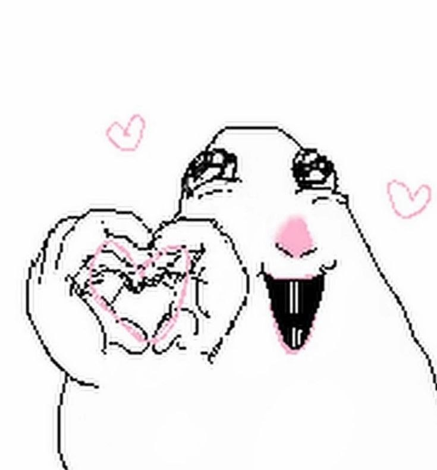
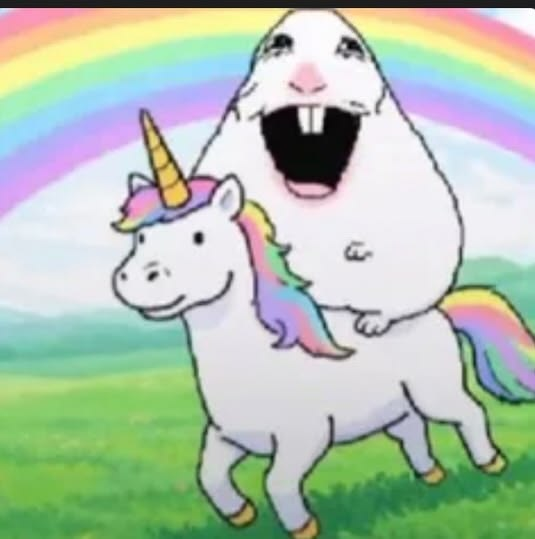
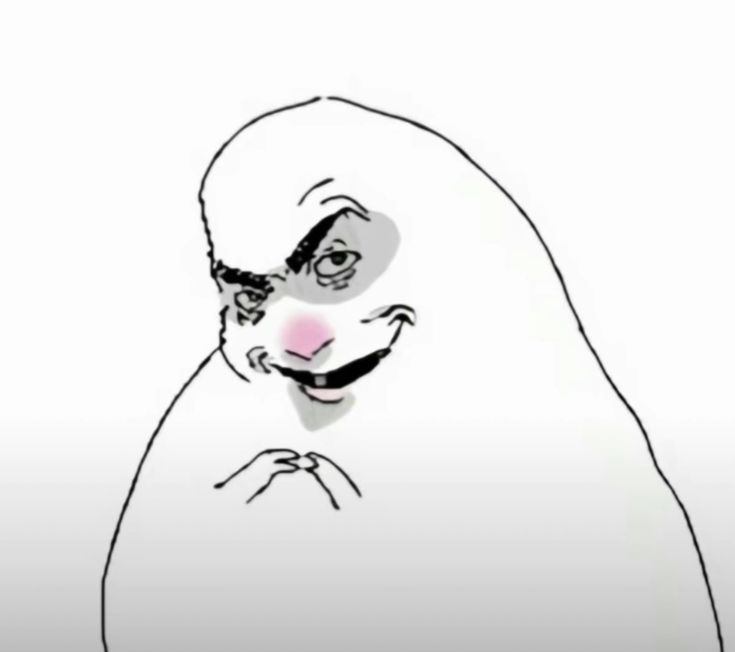

# Nombre del proyecto

## tarea-02

- **Isidora Pérez**
- **Katalina Ríos**

- Asignatura: Dispositivos Periféricos y Plataformas para la Interacción Digital **DIS9087**

Proyecto de reconocimiento de gestos, utilizando Python y MediaPipe. Realizado tomando como referencia este repositorio:

- <https://github.com/catherpiee/meowmeowcatcam>

## Gestos
| # | *Gesto* | *Cómo se activa*| *imagen* |
| --- | --- | --- | --- |
| 1 | Silly hamster | Predeterminado cuando no se realiza ningún gesto | 
| 2 | Corazón hamster | Ambas manos en forma de corazón | 
| 3 | Feliz hamster | Al sonreir y mostrar dientes | 
| 4 | Gym hamster | Brazo flectado hacia arriba con la mano en puño | 
| 5 | Hamster | Ambas palmas juntas | 
| 6 | Muehjej hamster | Ambos dedos índices juntos | 
| 7 | No sé hamster | Ambas palmas mirando hacia arriba | 
| 8 | Paz hamster | Una mano con dedos índice y dedo medio levantados y los demás cerrados | 
| 9 | Pizza hamster | Ambas manos con 4 dedos estirados apuntándose entre si | 

- [carpeta de imágenes](./nombreCarpeta)

- [video](./)

