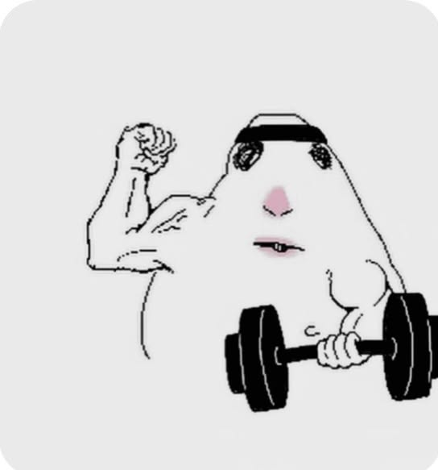
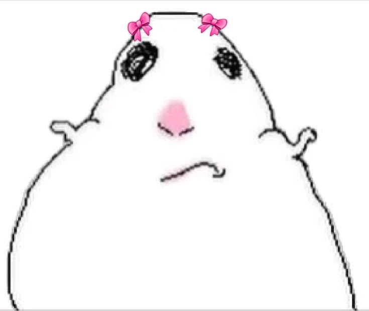
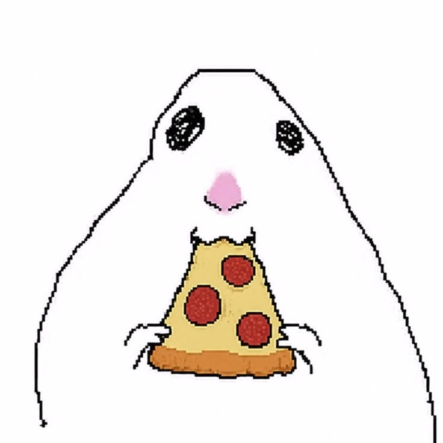

# tarea-02

## Integrantes

- Integrante 1: **Isidora Pérez**
- Integrante 2: **Katalina Ríos**

## Asignatura

**Dispositivos Periféricos y Plataformas para la Interacción Digital — DIS9087**

## Descripción del proyecto

Proyecto de reconocimiento de gestos utilizando Python, MediaPipe y una cámara web. La aplicación identifica gestos de las manos y expresiones faciales, y muestra en pantalla una imagen de hámster asociada a cada interacción.

En la asignatura de dispositivos periféricos realizamos un proyecto, el cual es capaz de detectar gestos, nosotras nos quisimos basar en memes actuales y nos basamos en un personaje específico llamado Silly Hamster, el cual en Pinterest se puede buscar y te aparecen diferentes imágenes con este personaje realizando diferentes acciones.

El proyecto fue realizado tomando como referencia el repositorio:

https://github.com/catherpiee/meowmeowcatcam

## Cambios realizados

- Se reemplazaron los memes de gatos originales por nueve imágenes nuevas de hámsters.
- Se eliminaron las imágenes antiguas de gatos de la carpeta `memes/`.
- Se modificó `app.js`, correspondiente a la versión web de la aplicación.
- Se modificó `gesture_meme.py`, correspondiente a la versión de escritorio en Python.
- Se añadió reconocimiento de sonrisa mediante los *blendshapes* faciales de MediaPipe.
- Se actualizaron los gestos para que sean distintos de los utilizados en el proyecto de referencia.
- Se actualizó `index.html` para mostrar el hámster predeterminado al iniciar la aplicación.

## Tecnologías utilizadas

- Python
- MediaPipe
- OpenCV
- JavaScript
- HTML y CSS
- Cámara web

## Gestos

## Gestos
| # | *Gesto* | *Cómo se activa*| *imagen* |
| --- | --- | --- | --- |
| 1 | Silly hamster | Predeterminado cuando no se realiza ningún gesto | 
| 2 | Corazón hamster | Realizar un corazón coreano con ambas manos, juntando pulgar e índice | 
| 3 | Feliz hamster | Sonrisa con boca abierta | 
| 4 | Gym hamster | Puño levantado junto a la cabeza | 
| 5 | Hamster | Ambas palmas semi  juntas | 
| 6 | Muehjej hamster |Unir las puntas de ambos índices | 
| 7 | No sé hamster |Levantar ambas palmas abiertas hacia arriba y hacia los lados | 
| 8 | Paz hamster | Una mano con dedos índice y dedo medio levantados, los demás dedos cerrados en forma de semi puño | 
| 9 | Pizza hamster | Ambas manos con 4 dedos estirados apuntándose entre si | 

## Ajustes de detección

- **Corazón hamster:** utiliza un corazón coreano de una mano, acercando el pulgar y el índice.
- **Muehjej hamster:** requiere que se toquen las puntas de ambos índices y también las puntas de ambos pulgares.
- **Hamster:** se activa al juntar ambas palmas; se permite una pequeña separación para que la cámara detecte las dos manos.
- **No sé hamster:** se activa con ambas manos abiertas y separadas, en la postura de pregunta con las palmas hacia arriba y hacia los lados.

## Carpeta de imágenes

Todas las imágenes utilizadas por la aplicación se encuentran en:

*carpeta imágenes*

https://github.com/schwii11/gatos/tree/main/memes

## Proceso del proyecto

Lo primero que realizamos ambas de manera individual fue hacer el ejercicio sobre el repositorio gatos, el cual nos sirvió como base para el proyecto.

Luego elegimos las nuevas imágenes que utilizaríamos para nuestro proyecto (silly hamster), donde no quisimos quedarnos solo con 6 imágenes que era lo mínimo del proyecto, si no que decidimos elegir un total de 9. Donde después con ayuda de la IA a utilizar "CODEX" pudimos realizar el nuevo localhost para nuestro proyecto con el reconocimiento de los nuevos gestos e imágenes. Donde los pasos a seguir son:

### Ejecución de la aplicación web

Desde la carpeta raíz del proyecto, ejecutar:

```powershell
Set-Location
python -m http.server 8001
```

Luego abrir en el navegador:

```text
http://localhost:8001
```

Se debe permitir el acceso a la cámara web. Para recargar la versión más reciente del proyecto en el navegador, utilizar `Ctrl + F5`.

### Ejecución con Python

Instalar las dependencias y ejecutar:

```powershell
python -m pip install -r requirements.txt
python gesture_meme.py
```

Presionar `q` o `Esc` para cerrar la aplicación.

## Video demostrativo
El siguiente video muestra el funcionamiento de la aplicación y los gestos implementados en el proyecto:

[Ver video demostrativo](video/video_repositorio%20sillyhamster.mp4)


